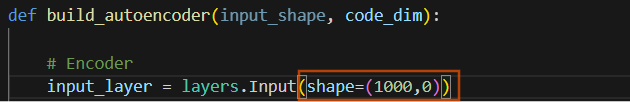

### Preprocesamiento de los datos antes de entrenar los modelos
Primeros pasos del proyecto:  
1. Data collection: obtenemos los datos raw. En este caso, los ficheros .root que contienen los pulso light y dark
2. Data cleaning: limpiamos los datos. Eliminamos columnas vacías, datos duplicados, datos irrelevantes, etc. Para este
proyecto, solo nos quedaremos con la columna dataChA, que contiene los pusos. Dentro de esta columna revisaremos que no 
haya pulsos duplicados.
3. Data Exploring: eliminamos valores atípicos que puedan sesgar el entrenamiento de los modelos. Examinaremos tmabién si 
hay relaciones entre caracterísitcas, en este caso no tenemos más caracteristicas.
4. Data preprocessing: si es necesario, normalizamos los datos o los escalamos, o convertirlos a un formato que el modelo
pueda entender. No es el caso, están todos los pulsos en el mismo formato.
5. Data splitting: división de los datos en **Training - validation - testing**
    - 1000 light + 1000 dark para entrenamiento
        - 80% entrenamiento y 20% validation
    - el resto para testing

### Finalmente se ha decidido por NO filtrar el dataset
**Conlusión:**
En reuniones con Alberto se ha tomado la decisión de solo tomar en cuenta una ventana significativa de muestras por cada pulso. Con el objetivo de
reducir carga computacional y suprimir los pulsos dobles.

## DUDAS:
Si tengo dos máximos locales en un solo pulso, al eliminar UNO  de ellos, no estoy eliminando el puslo, estaría eliminando muestras del pulso
Seguirían siendo 4722 pulsos pero esa muestra en vex de 10000 tendrá (por ejemplo) 9000 muestras.
**EN todo caso si quiero eliminar pulsos dobles sería comparar aquellos que estén practicamente superpuestos y quedarme con uno solo.**
**O lo que viene a ser lo mismo, ver si coinciden sus picos maximos y minimos, ya que si coinciden o son practiamente iguales, puedo quedarme con solo un pulso representativo**.

## ERRORES EN LA SEGMENTACION DE DATASET
El error too many indices for array ocurre porque, aunque creas tener una matriz de dos dimensiones, para NumPy tu objeto actual es una "lista" unidimensional de 4700 elementos donde cada elemento es, a su vez, otro array. Tu shape de (4700, 1) confirma que NumPy lo está tratando como una columna de objetos, no como una matriz de números de dos ejes.

### Opción 1: Convertirlo en una matriz 2D real
Si todos tus arrays internos miden exactamente 10,000, puedes "apilarlos" para crear una matriz de verdad. Esto te permitirá usar el rebanado (slicing) de dos índices que intentaste originalmente.

- Convertimos la estructura de objetos a una matriz 2D real
light_pulses_2d = np.stack(light_pulses.flatten())
- Ahora el slicing funcionará perfectamente
X_light = light_pulses_2d[0:1000, 1200:2000]

### Usar una lista de comprensión (Si no quieres convertir todo)
Solucionado! Se ha aplicado faltten para aplanar el array y sea mas manejable
Iteramos por los primeros 1000 arrays y cortamos cada uno:
X_light = np.array([fila[1200:2000] for fila in light_pulses[:1000].flatten()])

### Dia 22/04
Tenemos una primera versión del autoencoder. Se abren dos caminos:
1) Entrenar el autoencoder solo con pulsos DARK para que el modelo aprenda ha reconstruir, y por tanto identificar los pulsos DARK.
2) Entrenar el autoencoder con los os tipos de pulsos. El modelo transforma cada tipo de pulso en su code simplificado. Esta alternativa es interesante si queremos 
ver un mapa de distribución de los pulsos.

Idea: aplicaremos ambas opciones y nos quedaremos con la que mejor separe los pulsos LIGHT de los DARK.

### DIA 24/04
Errores en el entrenamiento del modelo:
history = autoencoder.fit(X_train_encoder, X_train_encoder,...)
mensaje de error:

ValueError",
	"message": "Exception encountered when calling Functional.call().\n\n\u001b[1mInput 0 with name 'None' of layer 'dense_16' is incompatible with the layer: expected axis -1 of input shape to have value 0, but received input with shape (32, 1000, 1)

Explicación:
Hay una desonexión entre la capa de entrada Input definida en el diseño de modelo:

y la forma real en la que llegan los datos desde el array:
Señales 1D por tanto un solo canal: (batch, longitud, canales)  = (2000,1000,1)

<b>Solución: (1000,1)</b>
Sin embargo, esto abre otro problema...  

Las capas Dense en Keras funcionan de forma particular con datos 3D: si les pasamos algo de forma (1000, 1), la capa Dense se aplica individualmente a cada una de las 1000 muestras, lo cual no es lo que quieres para un autoencoder de señales...
Para que el autoencoder procese el pulso de 1000 muestras como un "todo", debes usar capas Flatten y Reshape.
De hecho si nos fijamos en el diseño de la CNN vemos que se aplica la función Flatten() a cada una de las layers:
<i>model.add(layers.Flatten())</i>

Resumen: El error "expected axis -1 to have value 0" ocurría porque tu capa Dense intentaba operar sobre una dimensión de tamaño 0 (definida en tu Input). Al cambiarlo a (1000, 1) y usar Flatten, la lógica matemática de la red vuelve a ser coherente.

#### Nueva casuística: pintar el bottleneck
Me interesa pintar el bottleneck. Como el dato está aplanado, ¿para pintarlo necesito hacer un reshape nuevamente para el bottleneck o no es necesario?

<b>Respuesta:</b>
No es necesario hacer un reshape. La capa bottleneck es una capa Dense(16), la salida del modelo encoder será un array de forma (2000, 16). Esto significa que cada pulso se ha convertido en un vector plano de 16 números (sus "características comprimidas").

<b>Problema añadido con esto...</b>
Para graficar con plt.scatter, te encuentras con un problema de dimensiones: no puedes visualizar 16 dimensiones directamente en un plano 2D.
<b>Solución (la misma que aplicaron en el artículo)</b>
<i>Reducción de dimensionalidad con PCA:</i>
De esta manera proyectamos las 16 neuronas en 2 dimensiones. De hecho usar PCA es más fácil de utilizar que la alternativa t-sne. Esto es porque el método PCA, es un método lineal y no requiere ajustes de hiperparámetros complejos.

Ahora ya se puede representar en un plano 2D los puntos del bottleneck...
plt.scatter(bottleneck_2d[:, 0], bottleneck_2d[:, 1] ...)
Son las coordenadas cartesianas (x,y) de cada uno de los 2000 pulsos tras haber sido procesados por PCA.
fLUJO
Siendo bottleneck_2d[:, 0], los valores del primer componente(PC1), eje X.
bottleneck_2d[:, 1], los valores del segundo componente (PC2) eje Y.

Problemas de dimensionalidad al dibujar el pulso reconstruido:
ou're encountering a dimensionality mismatch because the Dense layers in your autoencoder are expecting flattened input, and the predict method needs input with a batch dimension. I will update the DarkPulsesDetector class to correctly handle input and output shapes using Flatten and Reshape layers. I'll also adjust the predict calls and plotting functions to ensure consistent dimensions. I'm also reducing the code_dim to 32, which is more typical for an autoencoder's latent space.

